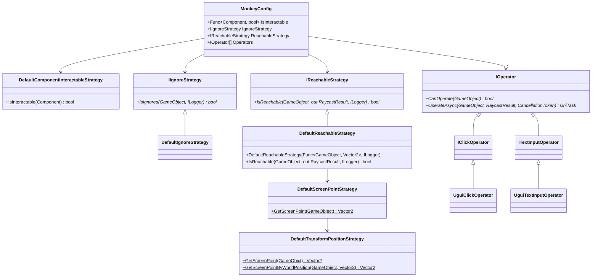

# UI Test Helper

[](https://github.com/nowsprinting/test-helper.ui/actions/workflows/metacheck.yml)
[](https://github.com/nowsprinting/test-helper.ui/actions/workflows/test.yml)
[](https://openupm.com/packages/com.nowsprinting.test-helper.ui/)
[](https://deepwiki.com/nowsprinting/test-helper.ui)

A Unity library for UI testing including object-based monkey testing.
(Formerly known as "Monkey Test Helper")

This library can be used in runtime code because it does **NOT** depend on the [Unity Test Framework](https://docs.unity3d.com/Packages/com.unity.test-framework@latest).  
Required Unity 2019 LTS or later.


## Features

### Find GameObject

`GameObjectFinder` is a class that finds `GameObject` by name, path, or custom matcher.

Constructor arguments:

- **timeoutSeconds**: Seconds to wait until `GameObject` appears. The default is 1 second.
- **reachableStrategy**: Strategy to examine whether `GameObject` is reachable from the user. The default implementation returns true if it can raycast from `Camera.main` to the pivot position.
- **isInteractable**: Function returns whether the `Component` is interactable or not. The default implementation returns true if the component is a uGUI compatible component and its `interactable` property is true.


#### Find GameObject by name

Find a `GameObject` by name; if not found, poll until a timeout.
If the timeout, a `TimeoutException` is thrown.

Arguments:

- **name**: Find `GameObject` name
- **reachable**: Find only reachable object. Default is true
- **interactable**: Find only interactable object. Default is false

Usage:

```csharp
using NUnit.Framework;
using TestHelper.UI;

[TestFixture]
public class MyIntegrationTest
{
    [Test]
    public async Task MyTestMethod()
    {
        var finder = new GameObjectFinder();
        var result = await finder.FindByNameAsync("ConfirmDialog", reachable: true, interactable: false);
        var dialog = result.GameObject;
    }
}
```


#### Find GameObject by path

Find a `GameObject` by path; if not found, poll until a timeout.
If the timeout, a `TimeoutException` is thrown.

Arguments:

- **path**: Find `GameObject` hierarchy path separated by `/`. Can specify wildcards of [glob](https://en.wikipedia.org/wiki/Glob_(programming)) pattern (`?`, `*`, and `**`).
- **reachable**: Find only reachable object. Default is true
- **interactable**: Find only interactable object. Default is false

Usage:

```csharp
using NUnit.Framework;
using TestHelper.UI;

[TestFixture]
public class MyIntegrationTest
{
    [Test]
    public async Task MyTestMethod()
    {
        var finder = new GameObjectFinder(5d); // 5 seconds timeout
        var result = await finder.FindByPathAsync("/**/Confirm/**/Cancel", reachable: true, interactable: true);
        var cancelButton = result.GameObject;
    }
}
```


#### Find GameObject by matcher

Find a `GameObject` by custom `IGameObjectMatcher`; if not found, poll until a timeout.
If the timeout, a `TimeoutException` is thrown.

Arguments:

- **matcher**: Custom `IGameObjectMatcher` implementation
- **reachable**: Find only reachable object. Default is true
- **interactable**: Find only interactable object. Default is false

Built-in matchers:

- `ComponentMatcher`: Matches by `name`, `path`, and component type
- `ButtonMatcher`: Matches `UnityEngine.UI.Button` components by `name`, `path`, `text`, and `texture`
- `ToggleMatcher`: Matches `UnityEngine.UI.Toggle` components by `name`, `path`, and `text`

Usage:

```csharp
using NUnit.Framework;
using TestHelper.UI;
using TestHelper.UI.GameObjectMatchers;

[TestFixture]
public class MyIntegrationTest
{
    [Test]
    public async Task MyTestMethod()
    {
        var finder = new GameObjectFinder();
        var matcher = new ButtonMatcher(text: "Click Me");
        var result = await finder.FindByMatcherAsync(matcher, reachable: true, interactable: false);
        var button = result.GameObject;
    }
}
```


#### Find GameObject in pageable component

Find a `GameObject` on pageable or scrollable UI components (e.g., `ScrollRect`, Carousel, Paged dialog) using the paginator.
A paginator provides step-by-step navigation through pageable content, allowing users to find objects that are not currently visible in the viewport.

Arguments:

- **matcher**: Custom `IGameObjectMatcher` implementation
- **reachable**: Find only reachable object. Default is true
- **interactable**: Find only interactable object. Default is false
- **paginator**: `IPaginator` implementation for controlling pageable components

Built-in paginators:

- `UguiScrollbarPaginator`: Used to find `GameObjects` that are on a scrollable component with a `ScrollBar`
- `UguiScrollRectPaginator`: Used to find `GameObjects` that are on `ScrollRect`

Usage:

```csharp
using NUnit.Framework;
using TestHelper.UI;
using TestHelper.UI.GameObjectMatchers;
using TestHelper.UI.Paginators;

[TestFixture]
public class MyIntegrationTest
{
    [Test]
    public async Task FindButtonInScrollView()
    {
        var finder = new GameObjectFinder();

        var scrollViewMatcher = new NameMatcher("Scroll View");
        var scrollViewResult = await finder.FindByMatcherAsync(scrollViewMatcher);
        var scrollRect = scrollViewResult.GameObject.GetComponent<ScrollRect>();
        var paginator = new UguiScrollRectPaginator(scrollRect);

        var matcher = new NameMatcher("Button_10");
        var result = await finder.FindByMatcherAsync(matcher, paginator: paginator);
        var button = result.GameObject;
    }
}
```


### Operate GameObject

You can perform any operation on [Unity UI](https://docs.unity3d.com/Packages/com.unity.ugui@latest) (uGUI) 2D, 3D, and UI elements.

Operators implement the `IOperator` interface. It has an `OperateAsync` method that operates on the component.
For example, `UguiClickOperator` implementation will perform the click.

Built-in operators:

- `UguiClickOperator`: Performs the click.
- `UguiClickAndHoldOperator`: Performs the click and hold; hold time can be specified.
- `UguiDoubleClickOperator`: Performs the double click; interval between clicks can be specified.
- `UguiDragAndDropOperator`: Performs the drag and drop; drag speed and destination can be specified. If omitted, drop positions are determined in the following order:
    1. Drop to the position that `GameObject` with `DropAnnotation` component if it exists. It will be random if there are multiple.
    2. Drop to the position that `GameObject` with implement `IDropHandler` component if it exists. It will be random if there are multiple.
    3. Drop to the random screen position.
- `UguiScrollWheelOperator`: Performs the scroll; scroll speed, direction, and distance can be specified. If direction and/or distance is omitted, it will be random.
- `UguiSwipeOperator`: Performs the swipe (including flick); swipe speed, distance, and direction can be specified. If direction is omitted, it will be random.
- `UguiTextInputOperator`: Inputs text into `InputField` and `TMP_InputField`; text can be specified. If omitted, it will be randomized text.
- `UguiToggleOperator`: Toggles the `Toggle` component; target value can be specified. If omitted, it will always be flipped (same as click).

Usage:

```csharp
using NUnit.Framework;
using TestHelper.UI;

[TestFixture]
public class MyIntegrationTest
{
    [Test]
    public async Task SendMessage()
    {
        var finder = new GameObjectFinder();

        var message = await finder.FindByNameAsync("Message", interactable: true);
        var inputOperator = new UguiTextInputOperator();
        await inputOperator.OperateAsync(message.GameObject, "Hello, Hurry?");

        var submit = await finder.FindByNameAsync("SubmitButton", interactable: true);
        var clickOperator = new UguiClickOperator();
        await clickOperator.OperateAsync(submit.GameObject);
    }
}
```

> [!TIP]  
> You can set the `Logger` and `ScreenshotOptions` instance via the constructor arguments or properties if needed.

> [!TIP]  
> All operators implement an overload method that takes only a `GameObject` for monkey testing.

> [!TIP]  
> If a flick operation is required, create a `UguiSwipeOperator` instance with arguments, for example, `swipeSpeed: 2000, swipeDistance: 80f`.


### Monkey Testing

#### Monkey.Run

You can run monkey testing for [Unity UI](https://docs.unity3d.com/Packages/com.unity.ugui@latest) (uGUI) 2D, 3D, and UI elements.
`Monkey.Run` method operates on a randomly selected `GameObject`. It does not use screen points.

The target `GameObject` and `Operator` will be determined by lottery in the following order:

1. List all interactable `GameObjects` on the screen (including those that are ignored and not reachable)
2. Join the `Operators` that can operate each `GameObject`
3. Lottery from the list of `GameObjects` and `Operators`
4. Check if the `GameObject` is ignored; If ignored, a re-lottery will be held
5. Check if the `GameObject` is reachable; If not reachable, a re-lottery will be held

Usage:

```csharp
using System;
using System.Threading.Tasks;
using NUnit.Framework;
using TestHelper.UI;

[TestFixture]
public class MyIntegrationTest
{
    [Test]
    public async Task MonkeyTesting()
    {
        var config = new MonkeyConfig
        {
            Lifetime = TimeSpan.FromMinutes(2),
            DelayMillis = 200,
            SecondsToErrorForNoInteractiveComponent = 5,
        };

        await Monkey.Run(config);
    }
}
```


#### MonkeyConfig

Configurations in `MonkeyConfig`:

- **Lifetime**: Running time
- **DelayMillis**: Delay time between operations
- **SecondsToErrorForNoInteractiveComponent**: Seconds after which a `TimeoutException` is thrown if no interactive component is found; default is 5 seconds
- **BufferLengthForDetectLooping**: An `InfiniteLoopException` is thrown if a repeating operation is detected within the specified buffer length; default length is 10
- **Random**: Pseudo-random number generator
- **Logger**: Logger
- **Verbose**: Output verbose log if true
- **Gizmos**: Show Gizmos on `GameView` during running monkey test if true
- **Screenshots**: Take screenshots during running the monkey test if set a `ScreenshotOptions` instance.
    - **Directory**: Directory to save screenshots. If omitted, the directory specified by command line argument "-testHelperScreenshotDirectory" is used. If the command line argument is also omitted, `Application.persistentDataPath` + "/TestHelper/Screenshots/" is used.
    - **FilenameStrategy**: Strategy for file paths of screenshot images. Default is test case name and four digit sequential number.
    - **SuperSize**: The factor to increase resolution with. Default is 1.
    - **StereoCaptureMode**: The eye texture to capture when stereo rendering is enabled. Default is `LeftEye`.
- **IsInteractable**: Function returns whether the `Component` is interactable or not. The default implementation returns true if the component is a uGUI compatible component and its `interactable` property is true.
- **IgnoreStrategy**: Strategy to examine whether `GameObject` should be ignored. The default implementation returns true if the `GameObject` has `IgnoreAnnotation` attached.
- **GetScreenPoint**: Function to get the screen point from `GameObject` used in the operators. The default implementation returns the pivot position of the `GameObject` in screen space.
- **ReachableStrategy**: Strategy to examine whether `GameObject` is reachable from the user. The default implementation returns true if it can raycast from `Camera.main` to the pivot position.
- **Operators**: A collection of `IOperator` that the monkey invokes. The default is `UguiClickOperator` and `UguiTextInputOperator`. There is support for standard uGUI components.

Class diagram for default strategies:




### Annotation Components

Use the `TestHelper.UI.Annotations` assembly by adding it to the Assembly Definition References.
Please note that this will be included in the release build due to the way it works.

> [!TIP]  
> Even if the annotations assembly is removed from the release build, the link to the annotation component will remain Scenes and Prefabs in the asset bundle built.
> Therefore, a warning log will be output during instantiate.
> To avoid this, annotations assembly are included in release builds.


#### Control ReachableStrategy

You can control the `DefaultReachableStrategy` behavior by attaching the annotation components to the `GameObject`.

##### ScreenOffsetAnnotation

Specifies the screen position offset from the pivot position when raycast by `DefaultReachableStrategy`.
Respects `CanvasScaler` but does not calculate the aspect ratio.

##### ScreenPositionAnnotation

Specifies the screen position when raycast by `DefaultReachableStrategy`.
Respects `CanvasScaler` but does not calculate the aspect ratio.

##### WorldOffsetAnnotation

Specifies the world position offset from the pivot position when raycast by `DefaultReachableStrategy`.

##### WorldPositionAnnotation

Specifies the world position when raycast by `DefaultReachableStrategy`.


#### Control Monkey

You can control the random behavior of the operator during the monkey testing by attaching the annotation components to the `GameObject`.

##### DropAnnotation

`UguiDragAndDropOperator` will preferentially drop onto `GameObject` with `DropAnnotation` attached.

##### IgnoreAnnotation

Monkey will not operate objects with `IgnoreAnnotation` attached.

##### InputFieldAnnotation

The `InputFieldAnnotation` can specify the kind and the length of characters that the `UguiTextInputOperator` will enter into the `InputField`.


### Editor Extensions

#### Copy Hierarchy Path to Clipboard

Select any `GameObject` in the Hierarchy window and right-click to open the context menu, then select **Copy to Clipboard > Hierarchy Path**.

#### Copy Instance ID to Clipboard

Select any `GameObject` in the Hierarchy window and right-click to open the context menu, then select **Copy to Clipboard > Instance ID**.


## Customization

### Functions for the strategy pattern

If your game title uses a custom UI framework that is not uGUI compatible and/or requires special operating, you can customize the `GameObjectFinder` and `Monkey` behavior using the following:


#### IsInteractable function

Returns whether the `Component` is interactable or not.
`DefaultComponentInteractableStrategy.IsInteractable` method returns true if the component is a uGUI-compatible component and its `interactable` property is true.

You should replace this when you want to control special components that comprise your game title.


#### IIgnoreStrategy interface

`IsIgnored` method returns whether the `GameObject` is ignored or not from `Monkey`.
`DefaultIgnoreStrategy.IsIgnored` method returns true if the `GameObject` has the `IgnoreAnnotation` component attached.

You should replace this when you want to ignore specific objects (e.g., by name and/or path) in your game title.


#### IReachableStrategy interface

`IsReachable` method returns whether the `GameObject` is reachable from the user or not.
`DefaultReachableStrategy.IsReachable` method returns true if it can raycast from `Camera.main` to the pivot position of `GameObject`.

You should replace this when you want to customize the raycast point (e.g., randomize position, specify camera).


### IGameObjectMatcher interface

If your game title uses a custom UI framework that is not uGUI compatible and/or requires custom conditions for searching, you can implement the `IGameObjectMatcher` interface.
The custom matcher can be specified as an argument to the `GameObjectFinder.FindByMatcherAsync` method.

For example, the built-in `ButtonMatcher` class's `IsMatch` method returns `true` for `GameObjects` that match the specified button element `name`, `path`, `text`, and `texture`.


### IPaginator interface

If your game title uses a custom pageable or scrollable UI components (e.g., Scroller, Carousel, Paged dialog), you can implement the `IPaginator` interface.
The custom paginator can be specified as an argument to the `GameObjectFinder.FindByMatcherAsync` method.

A paginator must implement the following methods and properties:

- `ComponentType` property to return the type of UI component that the paginator controls
- `ResetAsync` method to navigate to the top page
- `NextPageAsync` method to navigate to the next page
- `HasNextPage` property to return whether there is a next page


### IOperator interface

If your game title uses a custom UI framework that is not uGUI compatible, you can implement the `IOperator` interface.

A sub-interface of the `IOperator` (e.g., `IClickOperator`) must be implemented to represent the type of operator.
An operator must implement the `CanOperate` method to determine whether an operation, such as a click, is possible and the `OperateAsync` method to execute the operation.

> [!IMPORTANT]  
> Until test-helper.monkey v0.14.0, it took screenshots and output logs in the caller. However, this has been changed to `OperateAsync` responsible.

> [!TIP]  
> All operators implement an overload method that takes only a `GameObject` for monkey testing.


## Run on player build

The "Define Constraints" is set to `UNITY_INCLUDE_TESTS || INCLUDE_COM_NOWSPRINTING_TEST_HELPER` in this package's assembly definition files, so it is generally excluded from player builds.

To use the feature in player builds, add `INCLUDE_COM_NOWSPRINTING_TEST_HELPER` to the scripting symbols at build time.

> [!TIP]  
> How to set custom scripting symbols, see below:  
> [Manual: Custom scripting symbols](https://docs.unity3d.com/Manual/custom-scripting-symbols.html)


## Troubleshooting

### GameObjectFinder

#### Thrown TimeoutException

##### Not found

If no `GameObject` is found that matches the specified name, path, or matcher, throws a `TimeoutException` with the following message:

By name:

```
GameObject (name=Button) is not found.
```

By path:

```
GameObject (path=Path/To/Button) is not found.
```

By matcher:

```
GameObject (type=UnityEngine.UI.Button, text=START) is not found.
```

##### Not reachable

If `GameObject` is found that matches the specified name, path, or matcher but not reachable, throws a `TimeoutException` with the following message:

```
GameObject (name=CloseButton) is found, but not reachable.
```

If you need more details, pass an `ILogger` instance to the constructor of `DefaultReachableStrategy`, like this:

```
var reachableStrategy = new DefaultReachableStrategy(verboseLogger: Debug.unityLogger);
var finder = new GameObjectFinder(reachableStrategy: reachableStrategy);
var result = await finder.FindByNameAsync("StartButton", reachable: true);
```

If the following message is printed, the specified object is off-screen:

```
Not reachable to CloseButton(-2278), position=(515,-32). Raycast is not hit.
```

If the following message is printed, other object is hiding the pivot position of the specified object:

```
Not reachable to BehindButton(-2324), position=(320,240). Raycast hit other objects: [BlockScreen, FrontButton]
```

Solutions will be considered in the following order of priority:

1. Adjust the pivot position of the target GameObject to be in-screen and not hidden by other objects.
2. Adjust the location where the raycast is sent using annotation components such as `ScreenOffsetAnnotation`.
3. Customize `IReachableStrategy` to make special decisions for specific GameObjects

If the cause is hidden by other objects, you can choose the following solutions:

1. If the raycast hit object is not the interactable, turn off the `raycastTarget` property.
2. Makes the raycast hit object a child of the target object, so bubbles up.

##### Not interactable

If `GameObject` is found that matches the specified name, path, or matcher but not interactable, throws a `TimeoutException` with the following message:

```
GameObject (name=Button) is found, but not interactable.
```

#### Thrown MultipleGameObjectsMatchingException

If multiple `GameObjects` matching the condition are found, throw `MultipleGameObjectsMatchingException` with the following message:

```
Multiple GameObjects matching the condition (name=Button) were found.
```

#### Debug Visualizer

Using the Debug Visualizer can help you investigate why a `GameObject` cannot be found.
`DefaultDebugVisualizer` shows visual indicators when "not reachable" or "not interactable" occurs.

To use it, simply pass an instance to the `GameObjectFinder` constructor, like this:

```csharp
var visualizer = new DefaultDebugVisualizer();
var finder = new GameObjectFinder(visualizer: _visualizer);
```


### Monkey

#### Thrown TimeoutException

If thrown `TimeoutException` with the following message:

```
Interactive component not found in 5 seconds
```

This indicates that no `GameObject` with an interactable component appeared in the scene within specified seconds.
`GameObject` determined to be Ignored will be excluded, even if they are interactable.
`GameObject` that are not reachable by the user are excluded, even if they are interactable.

More details can be output using the verbose option (`MonkeyConfig.Verbose`).

The waiting seconds can be specified in the `MonkeyConfig.SecondsToErrorForNoInteractiveComponent`.
If you want to disable this feature, specify `0`.


#### Thrown InfiniteLoopException

If thrown `InfiniteLoopException` with the following message:

```
Found loop in the operation sequence: [44030, 43938, 44010, 44030, 43938, 44010, 44030, 43938, 44010, 44030]
```

This indicates that a repeating operation is detected within the specified buffer length.
The pattern `[44030, 43938, 44010]` is looped in the above message.
Numbers are the instance ID of the operated `GameObject`.

The detectable repeating pattern max length is half the buffer length.
The buffer length can be specified in the `MonkeyConfig.BufferLengthForDetectLooping`.
If you want to disable this feature, specify `0`.


#### Operation log message

```
UguiClickOperator operates to StartButton(-12345), screenshot=UguiMonkeyAgent01_0001.png
```

This log message is output just before the operator `UguiClickOperator` operates on the `GameObject` named `StartButton`.
"UguiMonkeyAgent01_0001.png" is the screenshot file name taken just before the operation.

Screenshots are taken when the `MonkeyConfig.Screenshots` is set.


#### Verbose log messages

You can output details logs when the `MonkeyConfig.Verbose` is true.

##### Lottery entries

```
Lottery entries: [
  StartButton(30502):Button:UguiClickOperator,
  StartButton(30502):Button:UguiClickAndHoldOperator,
  MenuButton(30668):Button:UguiClickOperator,
  MenuButton(30668):Button:UguiClickAndHoldOperator
]
```

Each entry format is `GameObject` name (instance ID) : `Component` type : `Operator` type.

This log message shows the lottery entries that the monkey can operate.
Entries are made by the `IsInteractable` and `Operator.CanOperate` method.
`IsIgnore` and `IsReachable` are not used at this time.

If there are zero entries, the following message is output:

```
No lottery entries.
```

##### Ignored GameObject

If the lotteries `GameObject` is ignored, the following message will be output and lottery again.

```
Ignored QuitButton(30388).
```

##### Not reachable GameObject

If the lotteries `GameObject` is not reachable by the user, the following messages will be output and lottery again.

```
Not reachable to CloseButton(-2278), position=(515,-32). Raycast is not hit.
```

Or

```
Not reachable to BehindButton(-2324), position=(320,240). Raycast hit other objects: [BlockScreen, FrontButton]
```

The former output is when the object is off-screen, and the latter is when other objects hide the pivot position.
The position to send the raycast can be arranged using annotation components such as `ScreenOffsetAnnotation`.

##### No GameObjects that are operable

If all lotteries `GameObject` are not operable, the following message is displayed.
If this condition persists, a `TimeoutException` will be thrown.

```
Lottery entries are empty or all of not reachable.
```

#### Debug Visualizer

Using the Debug Visualizer can help you investigate why a `GameObject` cannot be operated on.
`DefaultDebugVisualizer` shows visual indicators when "not reachable" or "ignored" occurs.

To use it, simply set an instance to the `MonkeyConfig.Visualizer`, like this:

```csharp
var config = new MonkeyConfig()
{
    Visualizer = new DefaultDebugVisualizer(),
};
await Monkey.Run(config);
```


## Installation

### 1. Install via Package Manager window

1. Open the Project Settings window (**Editor > Project Settings**) and select **Package Manager** tab (figure 1)
2. Click **+** button under the **Scoped Registries** and enter the following settings:
    1. **Name:** `package.openupm.com`
    2. **URL:** `https://package.openupm.com`
    3. **Scope(s):** `com.nowsprinting` and `com.cysharp`
3. Open the Package Manager window (**Window > Package Manager**) and select **My Registries** tab (figure 2)
4. Select **UI Test Helper** and click the **Install** button

> [!NOTE]  
> Do not forget to add `com.cysharp` into scopes. These are used within this package.

**Figure 1.** Scoped Registries setting in Project Settings window


**Figure 2.** My Registries in Package Manager window


### 2. Add assembly reference

1. Open your test assembly definition file (.asmdef) in **Inspector** window
2. Add **TestHelper.UI** into **Assembly Definition References**


## License

MIT License


## How to contribute

Open an issue or create a pull request.

Be grateful if you could label the PR as `enhancement`, `bug`, `chore`, and `documentation`.
See [PR Labeler settings](.github/pr-labeler.yml) for automatically labeling from the branch name.


## How to development

### Clone repo as a embedded package

Add this repository as a submodule to the Packages/ directory in your project.

```bash
git submodule add git@github.com:nowsprinting/test-helper.ui.git Packages/com.nowsprinting.test-helper.ui
```

> [!WARNING]  
> Required installation packages for running tests (when embedded package or adding to the `testables` in manifest.json), as follows:
> - [Unity Test Framework](https://docs.unity3d.com/Packages/com.unity.test-framework@latest) package v1.3.4 or later
> - [TextMesh Pro](https://docs.unity3d.com/Packages/com.unity.textmeshpro@latest) package or [Unity UI](https://docs.unity3d.com/Packages/com.unity.ugui@latest) package v2.0.0 or later


### Run tests

Generate a temporary project and run tests on each Unity version from the command line.

```bash
make create_project
UNITY_VERSION=2019.4.40f1 make -k test
```

> [!WARNING]  
> You must select "Input Manager (Old)" or "Both" in the **Project Settings > Player > Active Input Handling** for running tests.


### Release workflow

The release process is as follows:

1. Run **Actions > Create release pull request > Run workflow**
2. Merge created pull request

Then, will do the release process automatically by [Release](.github/workflows/release.yml) workflow.
After tagging, [OpenUPM](https://openupm.com/) retrieves the tag and updates it.

> [!CAUTION]  
> Do **NOT** manually operation the following operations:
> - Create a release tag
> - Publish draft releases

> [!CAUTION]  
> You must modify the package name to publish a forked package.

> [!TIP]  
> If you want to specify the version number to be released, change the version number of the draft release before running the "Create release pull request" workflow.
